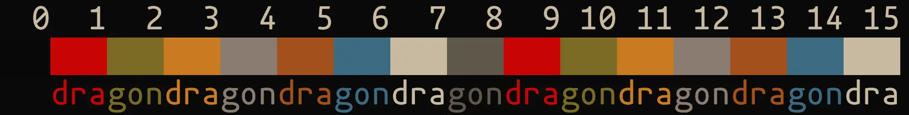

# Suburban
## About
This repository contains ports of the Suburban theme for terminal emulators.

Here is a preview that you can check it out:

## Palette
These are the colors used in its palette.

| Name                | ANSI | Hex Code  |
| ------------------- | ---- | --------- |
| Black (background)  | 0    | `#090909` |
| Red                 | 1    | `#c70404` |
| Green               | 2    | `#7a6b25` |
| Yellow              | 3    | `#c97b22` |
| Blue                | 4    | `#8a7c71` |
| Magenta             | 5    | `#a3501d` |
| Cyan                | 6    | `#3c6b82` |
| White (foreground)  | 7    | `#c7baa0` |
| Light Black         | 8    | `#5e584b` |
## Copyright
This software is under the BSD-3-Clause license. A copy of the license is
bundled with the source code.
